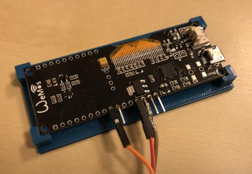

# smart meter connector
## general
Micropython project for ESP32-platform, that reads (mesurement) values from a smart meter (SML-protocol) and POST them to a HTTPS-Rest-API (using TLS) via wifi connection.

a version publishing data with MQTT can be found here: https://github.com/diyron/uP_SmartMeter_MQTT

tested with these electricity meter with infrared interface:
- easymeter Q3A
- easymeter Q3M
- EMH ED300L
- EFR SGM 
- ISKRA
- ITRON

software gets these values out of SML message:
- OBIS 1-0:0.0.9 - meter id
- OBIS 1.8.0 - total energy A+ [Wh] (meter reading)
- OBIS 16.7.0 - overall power consumption [W] 
- OBIS 36.7.0 - power consumption on L1 [W] 
- OBIS 56.7.0 - power consumption on L2 [W] 
- OBIS 76.7.0 - power consumption on L3 [W] 

### update (2020-02-23)
- add exception handling for TLS
- add NTP time sync for timestamp
- writes last exception with timestamp to file "crash_logs.txt"
- add counter for exceptions (experimental)

 
## prerequisites
1. smart meter with infrared interface and SML (smart message language) data output
2. infrared read head with TTL/UART output to read SML messages into ESP32 (like this: https://de.elv.com/elv-homematic-energiesensor-fuer-smart-meter-es-iec-komplettbausatz-142148)
3. ESP32 board with usable UART2 and (OLED-)display with I2C interface (e.g. SSD1306)
4. Micropython Firmware v1.12 (IDF3) for ESP32 (http://micropython.org/download)

 

## program sequence
1. connect to wifi
2. wait seconds set by "push_int"
3. try to read data from UART2 
4. extract values from meter data stream
5. push them as JSON via HTTPS request (POST)
6. goto 2.

## instructions for Wemos Lolin32 OLED
if you are using a different board, set up the pins corresponding to your system

- onboard OLED-display I2C pins: scl=Pin(4), sda=Pin(5)
- UART2 pins: rx=13, tx=15 (only RX of ESP32 is connected to the TX-Pin of the read head, due to the unidirectional interface of the meter) 
- install Micropython firmware (e.g. esptool.py)
- set up **your** parameters (see below) 
- copy files (main.py, sml_extr.py, ssd1306.py) to ESP32 filesystems (e.g. rshell)
- have fun!

## parameters (main.py)
- **nodename** - sets the wifi client name
- **wifi_ssid** - wifi ssid to connect to
- **wifi_pw** - wifi client password
- **push_int** - seconds to wait until next data push
- **url_tb** - Webservice API URL (something like **https://[URL]/[ACCESS-TOKEN]/[API-PATH]**)

## case
see folder **"case"**, it is designed with FreeCAD (v0.19), OBJ-file for 3D-printing is also available

 

 
you can press some magnets (diameter 8mm, height 3mm) into the blind holes to get the device stuck to the meter cabinet (if it's magnetic),
fix the case with some rubber band

 
