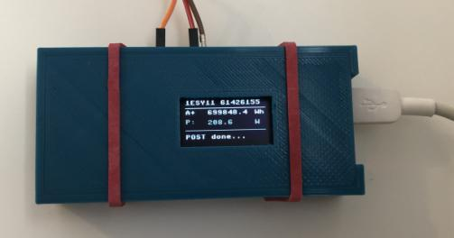
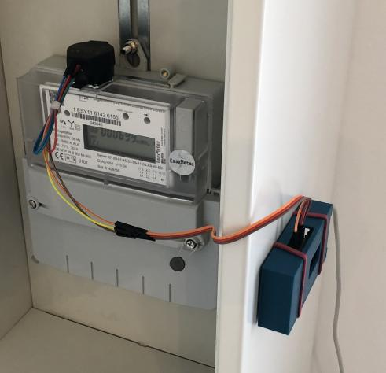

# uP_SmartMeter
## general
Micropython project for ESP32:
Getting (messurement) values from a smart meter and POST them to a HTTPS-Rest-API (using TLS).

## prerequisite
1. smart meter with infrared interface and SML (smart message manguage) data output (like easymeter)
2. infrared read head with TTL/UART output to read SML messages into ESP32 (like this: https://de.elv.com/elv-homematic-energiesensor-fuer-smart-meter-es-iec-komplettbausatz-142148)
3. ESP32 board with usable UART2 and (OLED-)display with i2c (e.g. SSD1306)
4. Micropython Firmware v1.12 for ESP32 (http://micropython.org/download)

 

## program sequence
1. connect to wifi
2. wait seconds set by "push_int"
3. try to read data from UART2 
4. extract values from meter data
5. push them by HTTPS request (POST)
6. goto 2

## instructions for Wemos Lolin32 OLED

- onboard OLED-display I2C pins: scl=Pin(4), sda=Pin(5)
- UART2 pins: rx=13, tx=15 (only rx is used, due to the unidirectional interface of the meter)

